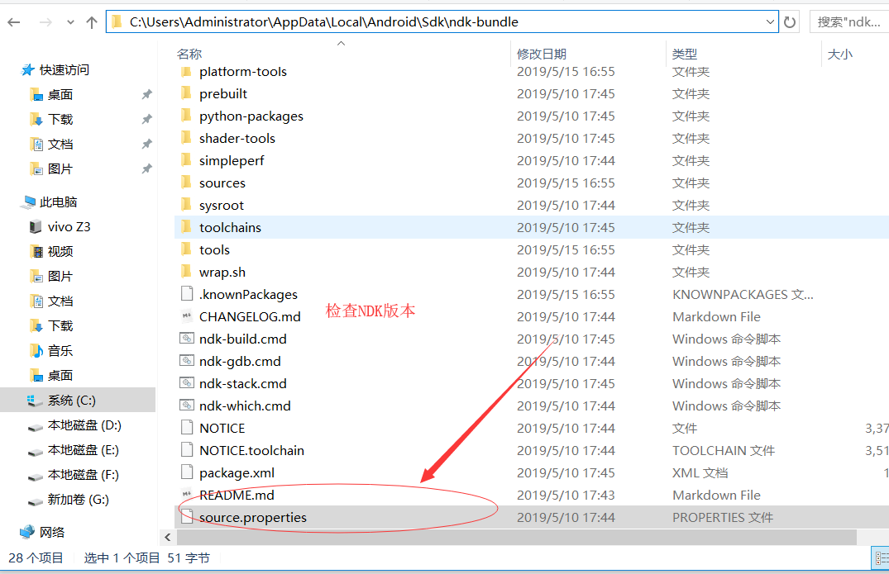
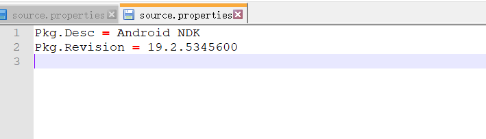
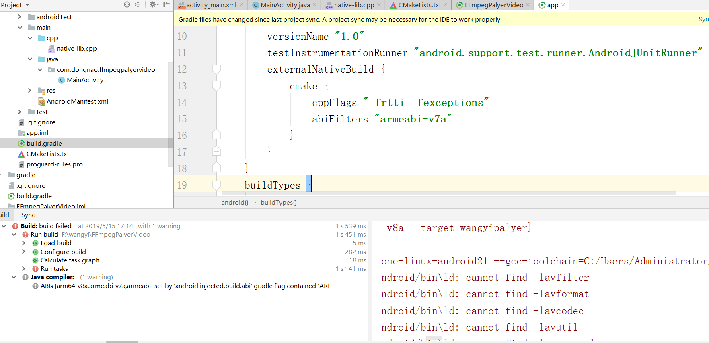

#### 报cannot find -lavfilter  找不到错误。

1  先检查libavfilter  libavcodec静态库路径  如果没问题

```Build command failed.


cannot find -lavfilter
D:/Sdk/ndk-bundle/toolchains/aarch64-linux-android-4.9/prebuilt/windows-x86_64/lib/gcc/aarch64-linux-android/4.9.x/../../../../aarch64-linux-android/bin\ld: cannot find -lavformat
D:/Sdk/ndk-bundle/toolchains/aarch64-linux-android-4.9/prebuilt/windows-x86_64/lib/gcc/aarch64-linux-android/4.9.x/../../../../aarch64-linux-android/bin\ld: cannot find -lavcodec
D:/Sdk/ndk-bundle/toolchains/aarch64-linux-android-4.9/prebuilt/windows-x86_64/lib/gcc/aarch64-linux-android/4.9.x/../../../../aarch64-linux-android/bin\ld: cannot find -lavutil
D:/Sdk/ndk-bundle/toolchains/aarch64-linux-android-4.9/prebuilt/windows-x86_64/lib/gcc/aarch64-linux-android/4.9.x/../../../../aarch64-linux-android/bin\ld: cannot find -lswresample
D:/Sdk/ndk-bundle/toolchains/aarch64-linux-android-4.9/prebuilt/windows-x86_64/lib/gcc/aarch64-linux-android/4.9.x/../../../../aarch64-linux-android/bin\ld: cannot find -lswscale
clang++.exe: error: linker command failed with exit code 1 (use -v to see invocation)
ninja: build stopped: subcommand failed.
```

2 如果还是不行   第二步  检查NDK版本   编辑source.properties 确保NDK是最新版本r19



 如果还是不行   第三步   检查在app 目录下的build.gradle中是否加入 abiFilters "armeabi-v7a" 这句话

  


-----------


