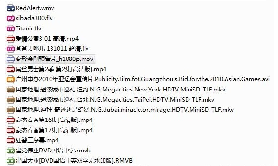

生活中的视音频技术
平时我们打开电脑中自己存电影的目录的话，一般都会如下图所示，一大堆五花八门的电影。（其实专业的影视爱好者一概会把影视文件分门别类的，但我比较懒，一股脑把电影放在了一起）

# 

因为下载的来源不同，这些电影文件有不同的格式，用不同的后缀表示：avi，rmvb，mp4，flv，mkv等等（当然也使用不同的图标）。在这里需要注意的是，这些格式代表的是封装格式。何为封装格式？就是把视频数据和音频数据打包成一个文件的规范。仅仅靠看文件的后缀，很难能看出具体使用了什么视音频编码标准。总的来说，不同的封装格式之间差距不大，各有优劣。

注：有些封装格式支持的视音频编码标准十分广泛，应该算比较优秀的封装格式，比如MKV；而有些封装格式支持的视音频编码标准很少，应该属于落后的封装格式，比如RMVB。

 

下面演示一下如何使用视频播放器查看一个视频文件采用的视音频技术：

注：在这里使用VLC作为演示，实际上暴风影音，QQ影音这些操作都差不太多。

1.打开一个视频文件

2.在视频画面上右键单击，选择属性。

3.在弹出的“属性”对话框的“MediaInfo”选项卡中，就可以查看该视频文件采用的视音频技术了。如下图所示，“变形金刚预告片_h1080p.mov”采用MPEG4的QuickTime封装格式（MOV），采用了H.264（AVC）的压缩编码标准。

在这里用到了一个查看媒体信息的工具：MediaInfo。MediaInfo是一个专门查看视音频格式的工具，软件的详细使用可参考：

MediaInfo使用简介（新版本支持HEVC）

源代码分析可参考：

MediaInfo源代码分析 1：整体结构[系列文章]

生活中的视音频技术到此为止，下面介绍一下具体的视音频技术。

 

1.     视频播放器原理
       视音频技术主要包含以下几点：封装技术，视频压缩编码技术以及音频压缩编码技术。如果考虑到网络传输的话，还包括流媒体协议技术。

视频播放器的源代码详细解析（Media Player Classic - HC，Mplayer，FFplay，XBMC）可以参考系列文章：

Media Player Classic：Media Player Classic - HC源代码分析 1：整体结构[系列文章]

Mplayer：MPlayer源代码分析

FFplay： FFplay源代码分析：整体流程图

XBMC： XBMC源代码分析 1：整体结构以及编译方法[系列文章]

在这里不细说了，仅简要说明一下视频播放器的原理。

视频播放器播放一个互联网上的视频文件，需要经过以下几个步骤：解协议，解封装，解码视音频，视音频同步。如果播放本地文件则不需要解协议，为以下几个步骤：解封装，解码视音频，视音频同步。他们的过程如图所示。

 

解协议的作用，就是将流媒体协议的数据，解析为标准的相应的封装格式数据。视音频在网络上传播的时候，常常采用各种流媒体协议，例如HTTP，RTMP，或是MMS等等。这些协议在传输视音频数据的同时，也会传输一些信令数据。这些信令数据包括对播放的控制（播放，暂停，停止），或者对网络状态的描述等。解协议的过程中会去除掉信令数据而只保留视音频数据。例如，采用RTMP协议传输的数据，经过解协议操作后，输出FLV格式的数据。

解封装的作用，就是将输入的封装格式的数据，分离成为音频流压缩编码数据和视频流压缩编码数据。封装格式种类很多，例如MP4，MKV，RMVB，TS，FLV，AVI等等，它的作用就是将已经压缩编码的视频数据和音频数据按照一定的格式放到一起。例如，FLV格式的数据，经过解封装操作后，输出H.264编码的视频码流和AAC编码的音频码流。

解码的作用，就是将视频/音频压缩编码数据，解码成为非压缩的视频/音频原始数据。音频的压缩编码标准包含AAC，MP3，AC-3等等，视频的压缩编码标准则包含H.264，MPEG2，VC-1等等。解码是整个系统中最重要也是最复杂的一个环节。通过解码，压缩编码的视频数据输出成为非压缩的颜色数据，例如YUV420P，RGB等等；压缩编码的音频数据输出成为非压缩的音频抽样数据，例如PCM数据。

视音频同步的作用，就是根据解封装模块处理过程中获取到的参数信息，同步解码出来的视频和音频数据，并将视频音频数据送至系统的显卡和声卡播放出来。

接下来的几节我们将会列出主要的流媒体协议，封装格式，以及视音频编码标准。更详细的比较可以参考：

