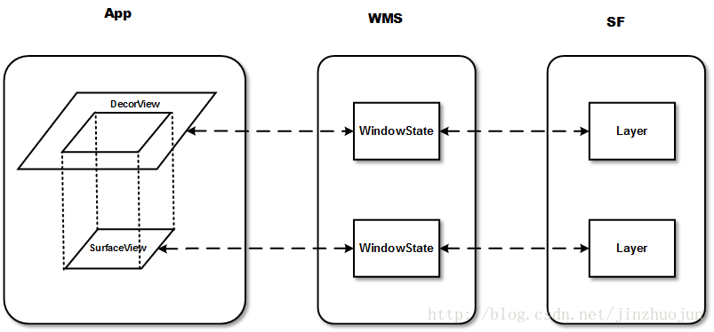

# 视频原生绘制

[TOC]

## View

### SurfaceView

​	Activity的View hierachy的树形结构，最顶层的DecorView，也就是根结点视图，在SurfaceFlinger中有对应的Layer。

​	对于具有SurfaceView的窗口来说，每一个SurfaceView在SurfaceFlinger服务中还对应有一个独立的Layer，用来单独描述它的绘图表面，以区别于它的宿主窗口的绘图表面。

​	在WMS和SurfaceFlinger中，它与宿主窗口是分离的。这样的好处是对这个Surface的渲染可以放到单独线程去做。这对于一些游戏、视频等性能相关的应用非常有益，因为它不会影响主线程对事件的响应。但它也有缺点，因为这个Surface不在View hierachy中，它的显示也不受View的属性控制，所以不能进行平移，缩放等变换，一些View中的特性也无法使用。




优点：

​	可以在一个独立的线程中进行绘制，不会影响主线程。

​	使用双缓冲机制，播放视频时画面更流畅。

缺点：	

​	Surface不在View hierachy中，显示也不受View的属性控制，所以不能进行平移，缩放等变换。


> 双缓冲：两张Canvas，一张frontCanvas和一张backCanvas，每次实际显示的是frontCanvas，backCanvas存储的是上一次更改前的视图，当使用lockCanvas（）获取画布，得到的backCanvas而不是正在显示的frontCanvas，之后在获取到的backCanvas上绘制新视图，再unlockCanvasAndPost更新视图，上传的这张canvas将替换原来的frontCanvas作为新的frontCanvas，原来的frontCanvas将切换到后台作为backCanvas。


### TextureView

​	在4.0(API level 14)中引入。和SurfaceView不同，不会在WMS中单独创建窗口，而是作为View hierachy中的一个普通View，因此可以和其它普通View一样进行移动，旋转，缩放，动画等变化。TextureView必须在硬件加速的窗口中。

优点：

​	支持移动、旋转、缩放等动画，支持截图

缺点：

​	必须在硬件加速的窗口中使用，占用内存比SurfaceView高(因为开启了硬件加速)，可能有1〜3帧延迟。


### Surface与SurfaceTexture

​	如果说Surface是画布(画框)， SurfaceTexture则是一幅画。可以使用`new Surface(SurfaceTexture)`创建一个Surface。SurfaceTexture并不直接显示图像，而是转为一个外部纹理(图像)，用于图像的二次处理。

```java
//创建一个纹理id
int[] mTextures = new int[1];
SurfaceTexture mSurfaceTexture = new SurfaceTexture(mTextures[0]);
//摄像头作为图像流 交给SurfaceTexture处理
Camera.setPreviewTexture(mSurfaceTexture);
//OpengGL可以通过 mTextures 对摄像头图像进行二次处理
```


## ANativeWindow

​	ANativeWindow代表的是本地窗口，可以看成NDK提供Native版本的Surface。通过`ANativeWindow_fromSurface`获得ANativeWindow指针，`ANativeWindow_release`进行释放。类似Java，可以对它进行lock、unlockAndPost以及通过`ANativeWindow_Buffer`进行图像数据的修改。

```c++
#include <android/native_window_jni.h>
//先释放之前的显示窗口
if (window) {
	ANativeWindow_release(window);
	window = 0;
}
//创建新的窗口用于视频显示
window = ANativeWindow_fromSurface(env, surface);
//设置窗口属性
ANativeWindow_setBuffersGeometry(window, w,
                                     h,
                                     WINDOW_FORMAT_RGBA_8888);

ANativeWindow_Buffer window_buffer;
if (ANativeWindow_lock(window, &window_buffer, 0)) {
	ANativeWindow_release(window);
	window = 0;
	return;
}
//填充rgb数据给dst_data
uint8_t *dst_data = static_cast<uint8_t *>(window_buffer.bits);
//......
ANativeWindow_unlockAndPost(window);
```

在NDK中使用ANativeWindow编译时需要链接NDK中的`libandroid.so`库

```cmake
#编译链接NDK/platforms/android-X/usr/lib/libandroid.so
target_link_libraries(XXX android )
```

