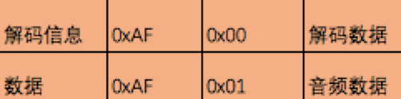

## AAC

https://zh.wikipedia.org/wiki/%E9%80%B2%E9%9A%8E%E9%9F%B3%E8%A8%8A%E7%B7%A8%E7%A2%BC

​	高级音频编码(Advanced Audio Coding)，出现于1997年，基于MPEG-2的音频编码技术,目的是取代MP3格式。2000年，MPEG-4标准出现后，AAC重新集成了其特性，为了区别于传统的MPEG-2 AAC又称为MPEG-4 AAC。相对于mp3，AAC格式的音质更佳，文件更小。

AAC的音频文件格式有 ADIF ＆ ADTS

/%E8%B5%84%E6%96%99/%E5%9B%BE%E7%89%87/aac%E6%A0%BC%E5%BC%8F.png)

​	一种是在连续的音频数据的开始处存有解码信息，一种是在每一小段音频数据头部存放7个或者9个字节的头信息用于播放器解码。	

​	RTMP推流需要的是aac的裸数据。所以如果编码出adts格式的数据，需要去掉7个或者9个字节的adts头信息。

类似于推送视频，第一个包总是包含sps和pps的音频序列包。

> 参考FLV.md 中 FLV Audio Tag Data部分

一般情况下，组装的音频AAC的RTMPPacket(RTMPDump中的结构体)为：

## FAAC

[FAAC](https://www.audiocoding.com/) (Freeware Advanced Audio Coder)。[下载页面](https://www.audiocoding.com/downloads.html) （FAAD2 是解码库）。

下载FAAC编码库源码：

`wget https://ayera.dl.sourceforge.net/project/faac/faac-src/faac-1.29/faac-1.29.9.2.tar.gz`

解压：