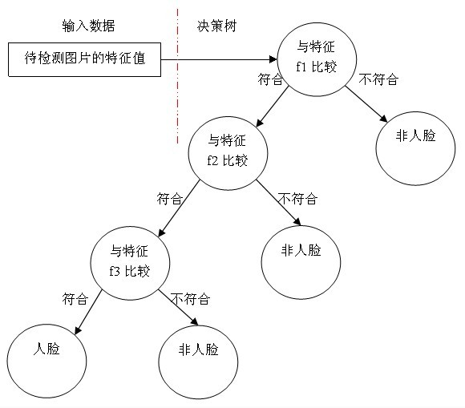

# 级联分类器

​	执行训练的时候会输出一系列的参数，其中可以看到：``【stageType: BOOST】``。boosting算法涉及到弱分类器和强分类器的概念。弱分类器分类正确率较低，但是较容易获得，强分类器分类正确率较高，但是较难获得。只要样本充足，弱学习可以通过一定的组合获得任意精度的强学习。级联分类器就是 N个弱分类器 以级联的方式，从简单到复杂逐步串联而成。

​	可以用决策树来构建一个简单的弱分类器， 将提取到的特征与分类器的特征进行逐个比较，从而判断该特征是否属于人脸：



而强分类器相当于先让各个弱分类器进行投票，然后让投票结果根据各弱分类器的错误率进行加权相加，最后与平均的投票结果进行比较得到最终结果。


## 训练

http://www.opencv.org.cn/opencvdoc/2.3.2/html/doc/user_guide/ug_traincascade.html

> 正样本：包含人脸的图片,灰度图。
> 正样本大小：统一大小并且不能小于负样本
> 负样本：不包含人脸的图片
> 负样本大小：无所谓
>
> 正、负样本个数比列大约为 1： 3 

### 制作正样本

正样本目录为：pos

假设目录结构如下：

 ```
/pos
  0.jpg
  1.jpg
pos.txt
 ```

文件pos.txt里的内容如下：

 ```shell
 #分别表示 1张人脸 ；人脸从 0,0坐标开始；大小为24x24
 pos/0.jpg 1 0 0 24 24
 #2个人脸； 人脸分别为 100,200处的50x50 和 50,30处的25x25为人脸
 pos/1.jpg 2 100 200 50 50   50 30 25 25
 #这部分内容可以使用java 程序来修改,如增加"pos/"
 ```

执行：（opencv环境变量配置opencv\build\x64\vc15\bin到path里）

> 这里生成样本的opencv_createsamples.exe以及后面训练级联器用到opencv_traincascade.exe在opencv 3.4.7版本以后被移除了，需要下载旧版本的opencv来进行训练，训练结果与版本无关，可以在opencv 4.x的版本上使用。

```shell
opencv_createsamples -info pos.txt -vec pos.vec -num 100 -w 24 -h 24 
-info: 正样本描述
-vec : 输出的正样本向量
-num : 正样本数量
-w -h: 输出样本的大小
#输出：Done. Created 100 samples  表示成功生成100个样本
```

## 制作负样本

负样本与正样本执行一样的操作，假如目录结构如下：

 ```shell
/neg
  0.jpg
  1.jpg
neg.txt
 ```

则neg.txt文件中的内容将如下所示：

 ```
neg/0.jpg
neg/1.jpg
 ```


## 训练

创建一个data 目录，执行：

```shell
opencv_traincascade -data data  -vec pos.vec -bg neg.txt -numPos 100 -numNeg 300  -numStages 15  -featureType LBP -w 24 -h 24

-data ： 需要手动创建，生成的结果 训练的模型会输出到这个目录
-vec  ： 正样本	
-bg	  ： 负样本
-numPos ：每级分类器训练时所用到的正样本数目
-numNeg ：每级分类器训练时所用到的负样本数目，可以大于-bg数目
-numStages：训练分类器的级数，如果层数多，分类器的误差就更小，但是检测速度慢。(15-20)
-featureType: LBP 
-w -h

输出：
Training until now has taken 0 days 0 hours 0 minutes 10 seconds.
表示成功

输出：
Required leaf false alarm rate achieved. Branch training terminated.
表示成功,但是误检率已经达标。(样本太少了)

输出：
Bad argument < Can not get new positive sample. The most possible reason is insufficient count of samples in given vec-file.
则意味着错误。


minHitRate：分类器的每一级希望得到的最小检测率。当设置为0.995时如果正训练样本个数为100个，那么其中的0.5个就很可能不被检测，第二次选择的时候必须多选择后面的5个，按照这种规律我们为后面的每级多增加numPos*minHitRate个正样本.
实际准备的正样本数量应该（读入vec的正样本数） >= numPos + (numStage - 1) * numPos * (1 - minHitRate) 
按照此公式计算： x+14*x*0.005 = 1.07*x ,也就是正样本数量要大于等于 1.07*x 而我们正样本是100，所以x = 93.45，但是此处传100也可以。
因为实际的检测率会比minHitRate高，所以在设置numPos时可以将其设置的稍微再大些，最终的目的是要尽量让所有的正样本都参与到训练中。但是，过大就会出错。
```


```c++
for (Rect face : faces) {
    rectangle(img, face, Scalar(255, 0, 255));
#ifdef COLECT_SAMPLES //采集样本
    Mat sample;
    frame(face).copyTo(sample);
    resize(sample, sample, Size(24, 24));
    cvtColor(sample, sample, COLOR_BGR2GRAY);
    char p[100];
    sprintf(p, "C:/Users/Administrator/Desktop/opencv/train/face/pos/%d.jpg", i++);
    imwrite(p, sample);
#endif
}

```


