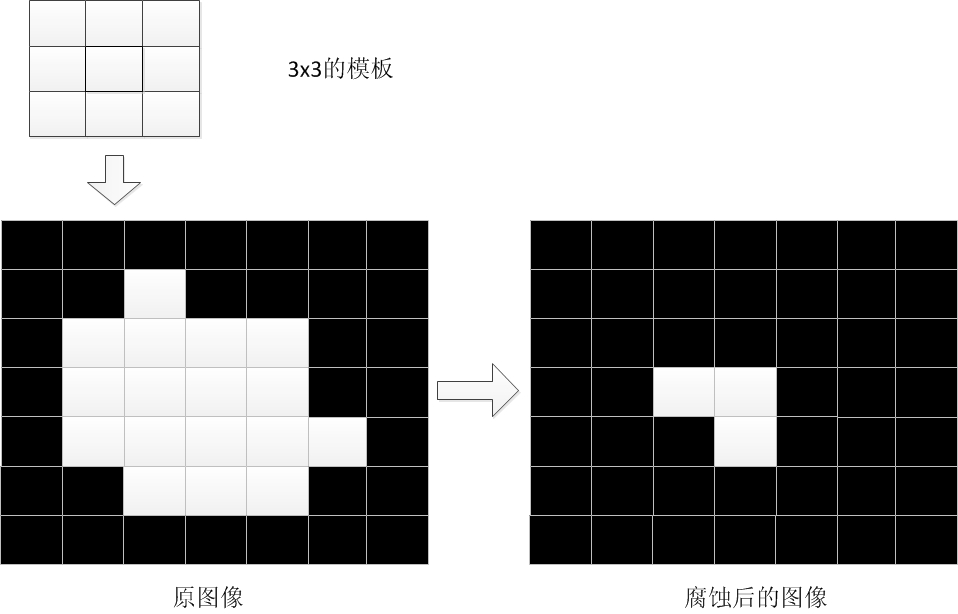
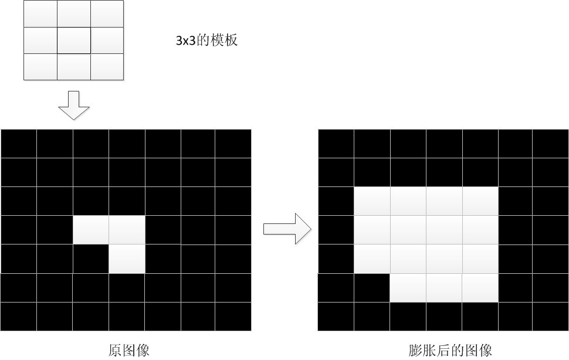
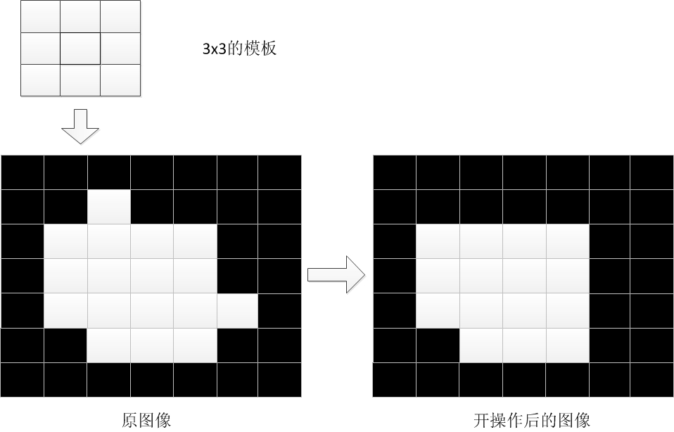
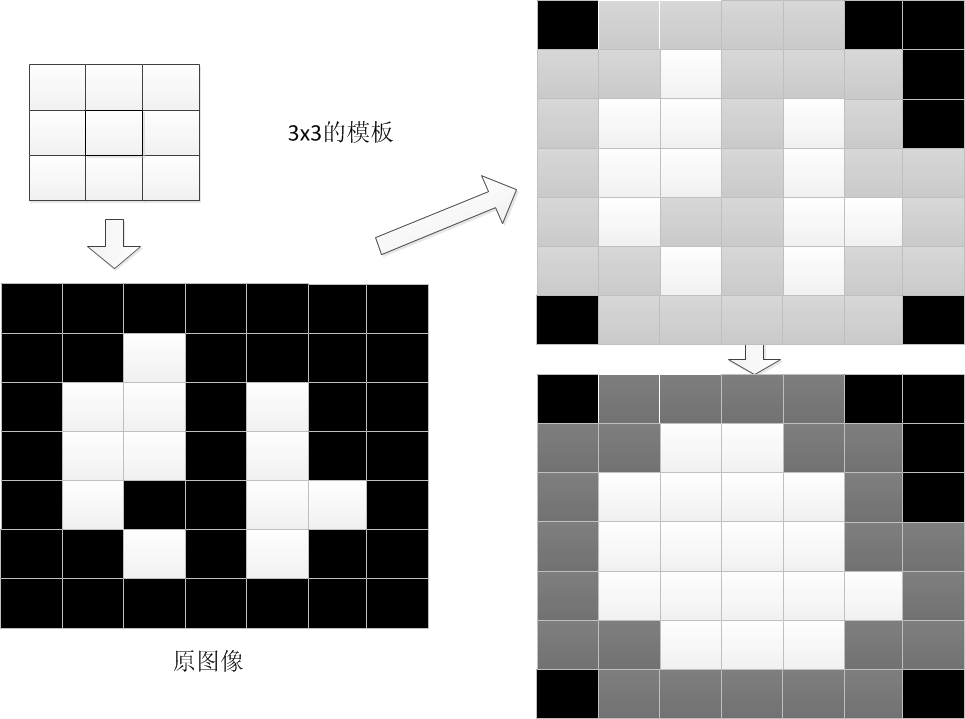
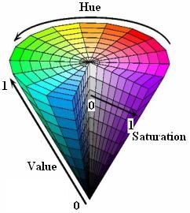
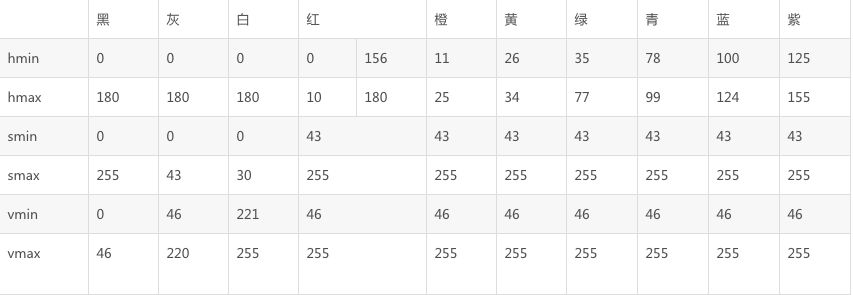

> 1、高斯模糊：http://www.ruanyifeng.com/blog/2012/11/gaussian_blur.html
>
> 目的：对图像去噪，为边缘检测算法做准备。

> 2、灰度化
>
> 目的：为边缘检测算法准备灰度化环境。

> 3、sobel运算（得到图像的一阶水平方向导数）：https://docs.opencv.org/2.4/doc/tutorials/imgproc/imgtrans/sobel_derivatives/sobel_derivatives.html
>
> 目的：检测图像中的垂直边缘，便于区分车牌。（Sobel运算只能对灰度图像有效，因此进行sobel运算前必须进行前面的灰度化工作）

> 4、二值化：（非黑即白）
>
> 目的：对图像的每个像素做一个阈值处理。为后续的形态学操作准备。
>
> （灰度图像中，每个像素值是0-255，表示灰暗程度。设定一个阈值t，小于t的设为0，否则设为1）

> 5、形态学操作（闭操作）
>
> 目的：将车牌字符连接成一个连通区域，便于取轮廓
>
> 形态学操作的对象是二值化图像，腐蚀，膨胀是许多形态学操作的基础。
>
> **腐蚀：**
>
> 原理：像素x至于模板的中心，根据模版的大小，遍历所有被模板覆盖的其他像素，修改像素x的值为所有像素中最小的值。（对于中心点像素x，模板范围内没有黑色则保留，否则该像素涂黑）
>
> 
>
> **膨胀：**
>
> 原理：与腐蚀操作相反
>
> 
>
> **开操作：**
>
> 原理：先腐蚀，再膨胀
>
> 
>
> **闭操作：**
>
> 原理：先膨胀，再腐蚀
>
> 

> 6、求轮廓
>
> 目的：将连通域的外围画出来，便于形成外接矩形

> 7、尺寸判断
>
> 目的：初步筛选排除不可能是车牌的矩形（中国车牌的一般大小是440mm*140mm，宽高比为3.14）

> 8、角度判断
>
> 目的：初步筛选排除不可能是车牌的矩形

> 9、旋转矩形
>
> 目的：将偏斜的车牌调整为水平，为后面的车牌判断与字符识别提高成功率
>
> 仿射变换：http://www.opencv.org.cn/opencvdoc/2.3.2/html/doc/tutorials/imgproc/imgtrans/warp_affine/warp_affine.html

> 10、调整大小
>
> 目的：确保候选车牌导入机器学习模型之前尺寸一致

## HSV颜色模型

> 如果我们想找出一副图像中的蓝色部分，我们需要检查rgb分量中的blue分量就可以了。一般blue分量是0-255的值，即便蓝色分量255了，由于另外两个分量的影响，需要考虑各个分量的配比问题，rgb作为颜色判断很难实现，就有了hsv模型hsv，photoshop中hsb

HSV(Hue, Saturation, Value)是根据颜色的直观特性由A. R. Smith在1978年创建的一种颜色空间, 也称六角锥体模型(Hexcone Model)。这个模型中颜色的参数分别是：色调（H），饱和度（S），明度（V）。

### 色调H

用角度度量，取值范围为0°～360°，从红色开始按逆时针方向计算，红色为0°，绿色为120°,蓝色为240°。它们的补色是：黄色为60°，青色为180°,品红为300°；

### 饱和度S

饱和度S表示颜色接近光谱色的程度。一种颜色，可以看成是某种光谱色与白色混合的结果。其中光谱色所占的比例愈大，颜色接近光谱色的程度就愈高，颜色的饱和度也就愈高。饱和度高，颜色则深而艳。光谱色的白光成分为0，饱和度达到最高。通常取值范围为0%～100%，值越大，颜色越饱和。

### 亮度V

亮度表示颜色明亮的程度，对于光源色，明度值与发光体的光亮度有关；对于物体色，此值和物体的透射比或反射比有关。通常取值范围为0%（黑）到100%（白）。

> 在OpenCV中hsv 数据为8UC则取值分别为 0-180 0-255 0-255 ,即蓝色应该是120

