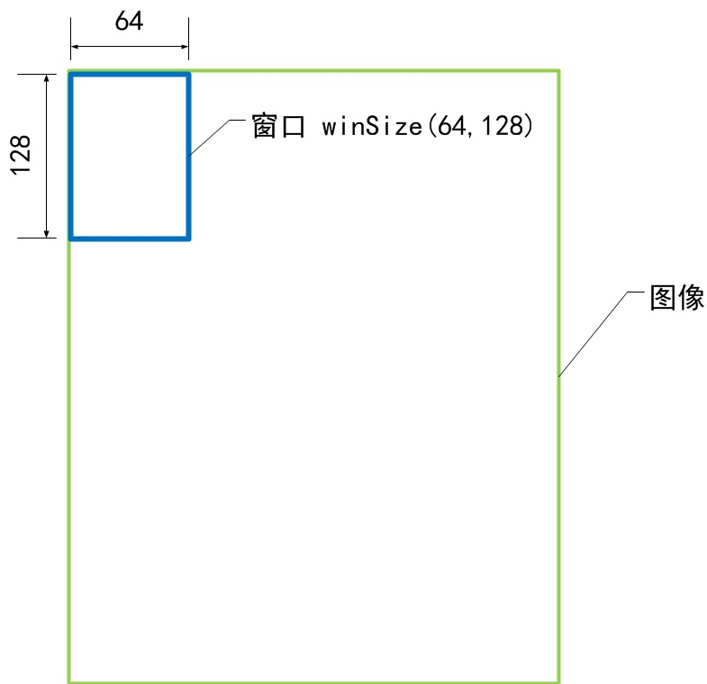

## SVM

http://blog.csdn.net/liukun321/article/details/41574617 

> 简单来说，SVM就是用于区分不同的类型(车牌、非车牌)。SVM的训练数据既有特征又有标签，通过训练，让机器可以自己找到特征和标签之间的联系，在面对只有特征没有标签的数据时，可以判断出标签。属于机器学习中的监督学习。	
>
> 核函数： 用于将不同类型进行**提维**（需要一点空间想象力）

**svm线性可分：**

**svm线性不可分：**

#### SVM训练流程：

#####  预处理 （原始数据->学习数据(无标签）

预处理步骤主要处理的是原始数据到学习数据的转换过程。（真正的车牌图片和不是车牌的图片）

##### 打标签 （学习数据(无标签)->学习数据(带标签)）

将未贴标签的数据转化为贴过标签的学习数据。

##### 分组（学习数据(带标签)->分组数据）

将数据分为训练集和测试集

##### 训练（训练数据->模型）

加载待训练的车牌数据和非车牌数据，合并数据，配置SVM模型的训练参数进行训练。

## HOG特征（Histogram of Oriented Gradient）

局部归一化的梯度方向直方图，是一种对图像局部重叠区域的密集型描述符, 它通过计算局部区域的梯度方向直方图来构成特征。

> 参数1(检测窗口)的宽- 参数2(块大小)的宽 结果与参数3(块滑动增量)的余数要为0 高也一样
>
> 参数4是胞元大小,参数5是梯度方向
>
>  HOGDescriptor hog(Size(128, 64), Size(16, 16), Size(8, 8), Size(8, 8), 3); 

检测窗口被分为：((128-16)/8+1)\*((64-16)/8+1)=105个块(Block);

一个Block有4个胞元(Cell);

一个Cell的Hog描述子向量的长度是9;

统计梯度直方图特征,就是将梯度方向（0-360）划分为x个区间，将图像化为16x16的若干个窗口，每个窗口又划分为x个block,每个block再化为4个cell（8x8）。对每一个cell,算出每一像素点的梯度方向，按梯度方向增加对应bin的值，最终综合N个cell的梯度直方图组成特征。

简单来说，车牌的边缘与内部文字组成的一组信息(在边缘和角点的梯度值是很大的，边缘和角点包含了很多物体的形状信息)，HOG就是抽取这些信息组成一个直方图。

> HOG : 梯度方向弱化光照的影响，适合捕获轮廓。
>
> LBP : 中心像素的LBP值反映了该像素周围区域的纹理信息。

