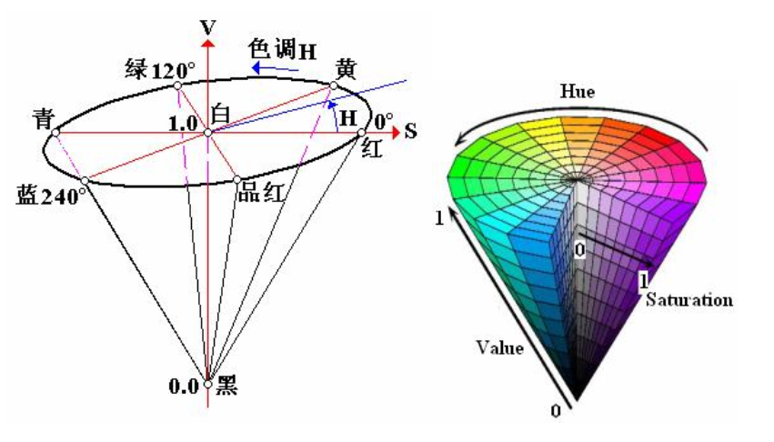
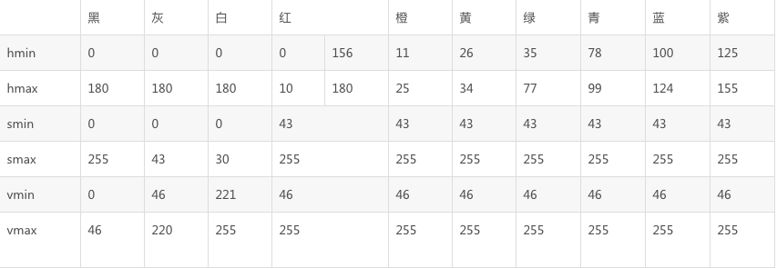

## HSV颜色模型

> 如果我们想找出一副图像中的蓝色部分，我们需要检查rgb分量中的blue分量就可以了。一般blue分量是0-255的值，即便蓝色分量255了，由于另外两个分量的影响，需要考虑各个分量的配比问题，rgb作为颜色判断很难实现，就有了hsv模型hsv，photoshop中hsb

HSV(Hue, Saturation, Value)是根据颜色的直观特性由A. R. Smith在1978年创建的一种颜色空间, 也称**六角锥体模型**(Hexcone Model)。这个模型中颜色的参数分别是：色调（H），饱和度（S），明度（V）。

### 色调H

用角度度量，取值范围为0°～360°，从红色开始按逆时针方向计算，红色为0°，绿色为120°,蓝色为240°。它们的补色是：黄色为60°，青色为180°,品红为300°；

### 饱和度S

饱和度S表示颜色接近光谱色的程度。一种颜色，可以看成是某种光谱色与白色混合的结果。其中光谱色所占的比例愈大，颜色接近光谱色的程度就愈高，颜色的饱和度也就愈高。饱和度高，颜色则深而艳。光谱色的白光成分为0，饱和度达到最高。通常取值范围为0%～100%，值越大，颜色越饱和。

### 亮度V

亮度表示颜色明亮的程度，对于光源色，明度值与发光体的光亮度有关；对于物体色，此值和物体的透射比或反射比有关。通常取值范围为0%（黑）到100%（白）。

> 在OpenCV中hsv 数据为8UC则取值分别为 0-180 0-255 0-255 ,即蓝色240对应的应该是120

